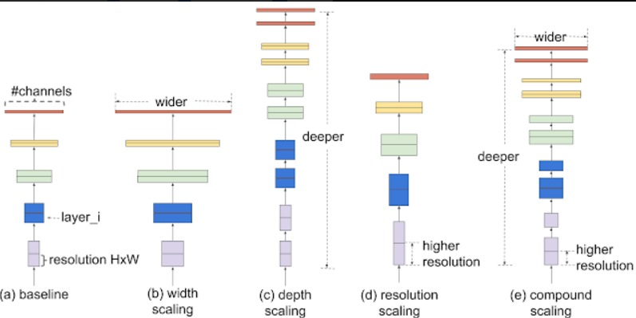
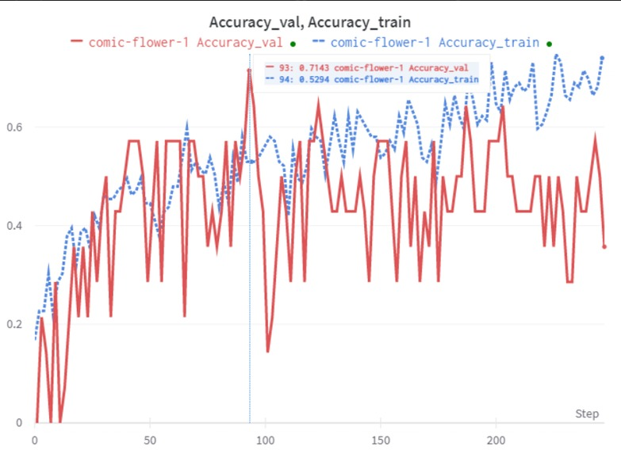
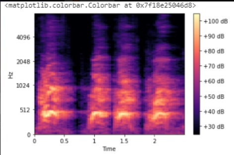

# BarkSpeak

A Deep Learning Solution for Canine Vocalization Analysis

This project is a highly technical, end-to-end machine learning pipeline that transforms a challenging bio-acoustic problem into an innovative consumer application. It demonstrates the use of deep learning to classify and translate complex, non-human sounds, bridging the communication gap between humans and their canine companions.

## ⚙️ Technical Architecture & Machine Learning Pipeline

Our solution treats sound classification as an image recognition problem by leveraging the power of deep learning. The core of the system is a multi-stage pipeline designed for efficiency and accuracy.

### 1. Data Ingestion & Preprocessing

We sourced and meticulously labeled a diverse dataset of dog vocalizations, including barks, whimpers, and howls. The data was classified based on key acoustic features: sentiment, tempo, and repetitiveness. This rigorous data classification process was fundamental to the model's ability to generalize and make accurate predictions.

### 2. Audio-to-Spectrogram Conversion

Raw audio files were preprocessed and converted into spectrograms—visual representations of the sound's frequency over time. This crucial step transformed the time-series audio data into a format (an image) that our deep learning model could easily consume.

### 3. Model Training on Azure ML

The spectrograms were used to train a custom deep learning model. We utilized Azure Machine Learning for this process, which provided a robust, GPU-accelerated environment. Azure ML allowed us to build an efficient ML pipeline that streamlined experimentation and reduced training time significantly. The model's performance was closely monitored, with training and validation accuracy curves indicating effective learning and generalization.

### 4. Classification & Interpretation

The trained model analyzes the spectrogram and outputs a predicted class (e.g., "Excited," "Anxious," "Warning"). A key aspect of our approach is the ability to interpret these predictions. Grad-CAM (Gradient-weighted Class Activation Mapping) could be implemented in future iterations to generate a heatmap over the spectrogram, highlighting the specific frequency-time regions that most contributed to the model's decision, thereby providing an extra layer of explainability to our classifications.

The model was deployed and integrated into a responsive web application using Flask. This served as the bridge between our backend Python logic and the front end. The web interface, designed with Figma and built with HTML, CSS, JavaScript, and JQuery, provides a seamless user experience for live recording or uploading audio files.

## 🚧 Technical Challenges & Strategic Learnings

Building this project in a short period presented significant technical hurdles:

- **Dataset Acquisition:** Finding a diverse and well-labeled dataset of dog vocalizations was a primary challenge, as data quality is paramount to a model's performance.

- **Environment Discrepancies:** We faced challenges migrating frontend code developed in Repl to a Flask environment, which highlighted the importance of consistent development pipelines.

## 🚀 Accomplishments & Impact

This project is a testament to the team's ability to apply advanced machine learning techniques to a novel problem. We successfully built a functional, end-to-end ML pipeline, showcasing a deep understanding of:

- **Data Preparation & Feature Engineering:** Transforming raw audio into a usable format.
- **Model Training & Evaluation:** Efficiently training a deep learning model with GPU acceleration.
- **Full-Stack Deployment:** Integrating a machine learning backend with a responsive web application.

This work lays the groundwork for future advancements, including integration with Google Home and Alexa for real-time translation, and the potential for a "reverse translation" feature for two-way communication.

